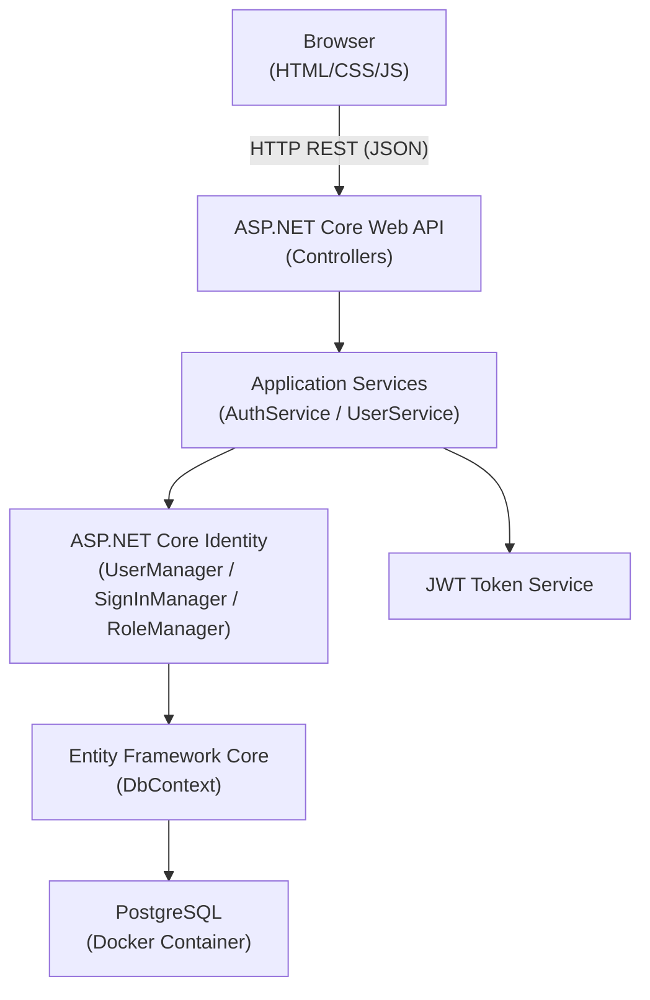
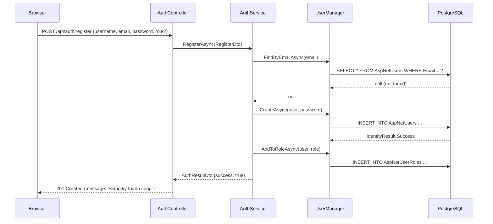
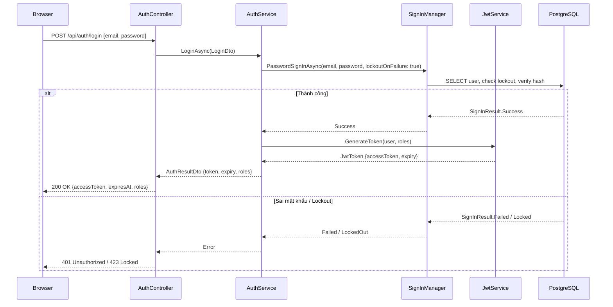
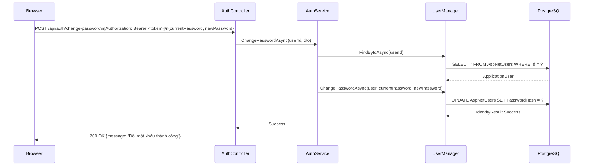
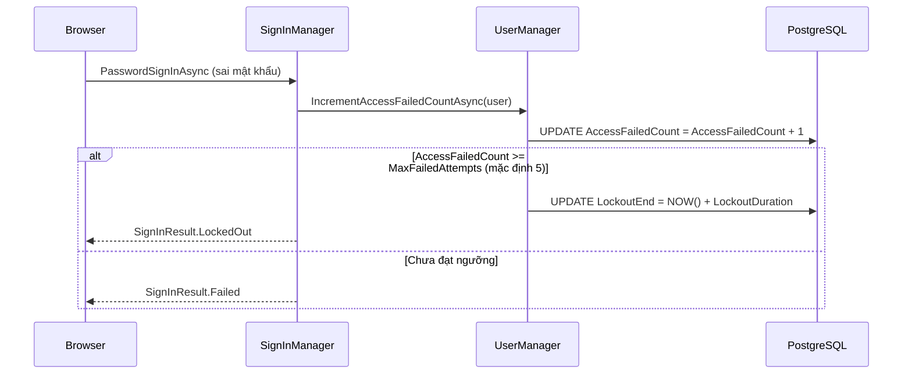

# Design Document: dotnet-identity-auth

## Overview

Hệ thống xác thực và phân quyền backend được xây dựng trên ASP.NET Core Identity với PostgreSQL, cung cấp đầy đủ các tính năng: đăng ký, đăng nhập/đăng xuất, đổi mật khẩu, lockout tài khoản, và phân quyền theo vai trò (Roles). Giao diện người dùng sử dụng HTML/CSS/JavaScript thuần, giao tiếp với backend qua REST API. Toàn bộ hệ thống được container hóa với PostgreSQL chạy trong Docker.

Hệ thống được thiết kế theo kiến trúc phân lớp (Layered Architecture) với tách biệt rõ ràng giữa API Controllers, Application Services, Domain Models và Infrastructure (EF Core + PostgreSQL). ASP.NET Core Identity đảm nhận toàn bộ logic xác thực, mã hóa mật khẩu, quản lý token và lockout. JWT Bearer Token được dùng cho stateless authentication, phù hợp với frontend JavaScript thuần.

---

## Architecture




## Sequence Diagrams

### Đăng ký tài khoản (Register)



### Đăng nhập (Login)




### Đổi mật khẩu (Change Password)



### Lockout Flow



---

## Components and Interfaces

### Component 1: AuthController

**Purpose**: Tiếp nhận HTTP request, validate input, gọi AuthService và trả về HTTP response.

**Interface**:
```csharp
[ApiController]
[Route("api/auth")]
public class AuthController : ControllerBase
{
    [HttpPost("register")]
    Task<IActionResult> Register([FromBody] RegisterDto dto);

    [HttpPost("login")]
    Task<IActionResult> Login([FromBody] LoginDto dto);

    [HttpPost("logout")]
    [Authorize]
    Task<IActionResult> Logout();

    [HttpPost("change-password")]
    [Authorize]
    Task<IActionResult> ChangePassword([FromBody] ChangePasswordDto dto);

    [HttpGet("me")]
    [Authorize]
    Task<IActionResult> GetCurrentUser();
}
```

**Responsibilities**:
- Validate ModelState (Data Annotations)
- Trích xuất userId từ JWT Claims
- Map kết quả từ Service sang HTTP status codes phù hợp
- Không chứa business logic


### Component 2: UserController

**Purpose**: Quản lý người dùng và phân quyền (dành cho Admin).

**Interface**:
```csharp
[ApiController]
[Route("api/users")]
[Authorize(Roles = "Admin")]
public class UserController : ControllerBase
{
    [HttpGet]
    Task<IActionResult> GetAllUsers();

    [HttpGet("{id}")]
    Task<IActionResult> GetUserById(string id);

    [HttpPost("{id}/roles")]
    Task<IActionResult> AssignRole(string id, [FromBody] AssignRoleDto dto);

    [HttpDelete("{id}/roles/{role}")]
    Task<IActionResult> RemoveRole(string id, string role);

    [HttpPost("{id}/unlock")]
    Task<IActionResult> UnlockUser(string id);
}
```

**Responsibilities**:
- CRUD người dùng (Admin only)
- Gán/xóa role
- Mở khóa tài khoản bị lockout

### Component 3: IAuthService / AuthService

**Purpose**: Chứa toàn bộ business logic xác thực.

**Interface**:
```csharp
public interface IAuthService
{
    Task<AuthResult> RegisterAsync(RegisterDto dto);
    Task<AuthResult> LoginAsync(LoginDto dto);
    Task<AuthResult> ChangePasswordAsync(string userId, ChangePasswordDto dto);
    Task<AuthResult> LogoutAsync(string userId);
}

public class AuthService : IAuthService
{
    private readonly UserManager<ApplicationUser> _userManager;
    private readonly SignInManager<ApplicationUser> _signInManager;
    private readonly IJwtService _jwtService;
    private readonly RoleManager<IdentityRole> _roleManager;
}
```

**Responsibilities**:
- Orchestrate UserManager và SignInManager
- Gọi JwtService để tạo token
- Trả về AuthResult (success/failure + data)

### Component 4: IJwtService / JwtService

**Purpose**: Tạo và validate JWT Bearer Token.

**Interface**:
```csharp
public interface IJwtService
{
    string GenerateToken(ApplicationUser user, IList<string> roles);
    ClaimsPrincipal? ValidateToken(string token);
}
```

**Responsibilities**:
- Tạo JWT với claims: sub, email, roles, jti, exp
- Ký token bằng HMAC-SHA256 với secret key từ config
- Validate token khi cần thiết

### Component 5: ApplicationDbContext

**Purpose**: EF Core DbContext kết nối PostgreSQL, tích hợp Identity.

**Interface**:
```csharp
public class ApplicationDbContext : IdentityDbContext<ApplicationUser>
{
    public ApplicationDbContext(DbContextOptions<ApplicationDbContext> options)
        : base(options) { }

    protected override void OnModelCreating(ModelBuilder builder)
    {
        base.OnModelCreating(builder);
        // Custom configurations
    }
}
```


---

## Data Models

### Model 1: ApplicationUser

```csharp
public class ApplicationUser : IdentityUser
{
    // IdentityUser cung cấp sẵn:
    // string Id (GUID)
    // string UserName
    // string Email
    // string PasswordHash
    // bool EmailConfirmed
    // int AccessFailedCount
    // DateTimeOffset? LockoutEnd
    // bool LockoutEnabled
    // string? SecurityStamp

    // Custom fields:
    public string? FullName { get; set; }
    public DateTime CreatedAt { get; set; } = DateTime.UtcNow;
    public DateTime? LastLoginAt { get; set; }
    public bool IsActive { get; set; } = true;
}
```

**Validation Rules**:
- `Email`: bắt buộc, định dạng email hợp lệ, unique
- `UserName`: bắt buộc, 3-50 ký tự, không chứa ký tự đặc biệt
- `PasswordHash`: được quản lý bởi Identity (PBKDF2)
- `LockoutEnd`: null = không bị khóa; > UtcNow = đang bị khóa

### Model 2: DTOs (Data Transfer Objects)

```csharp
public record RegisterDto(
    [Required] string UserName,
    [Required][EmailAddress] string Email,
    [Required][MinLength(8)] string Password,
    string? FullName,
    string Role = "User"  // Default role
);

public record LoginDto(
    [Required][EmailAddress] string Email,
    [Required] string Password
);

public record ChangePasswordDto(
    [Required] string CurrentPassword,
    [Required][MinLength(8)] string NewPassword,
    [Required][Compare("NewPassword")] string ConfirmNewPassword
);

public record AssignRoleDto(
    [Required] string RoleName
);

public record AuthResult(
    bool Success,
    string? AccessToken,
    DateTime? ExpiresAt,
    IList<string>? Roles,
    string? Error,
    bool IsLockedOut = false
);

public record UserInfoDto(
    string Id,
    string UserName,
    string Email,
    string? FullName,
    IList<string> Roles,
    bool IsLockedOut,
    DateTime CreatedAt
);
```

### Model 3: Identity Tables (PostgreSQL — auto-generated by EF Core)

| Tên bảng | Mô tả |
|---|---|
| `AspNetUsers` | Thông tin người dùng (ApplicationUser) |
| `AspNetRoles` | Danh sách roles (Admin, User, Moderator...) |
| `AspNetUserRoles` | Mapping user ↔ role (many-to-many) |
| `AspNetUserClaims` | Claims gắn với user |
| `AspNetRoleClaims` | Claims gắn với role |
| `AspNetUserLogins` | External login providers |
| `AspNetUserTokens` | Tokens (refresh token, email confirm...) |

---

## Algorithmic Pseudocode

### Algorithm 1: RegisterAsync

```csharp
public async Task<AuthResult> RegisterAsync(RegisterDto dto)
{
    // Precondition: dto != null, dto.Email valid, dto.Password >= 8 chars
    
    // Step 1: Kiểm tra email đã tồn tại chưa
    var existingUser = await _userManager.FindByEmailAsync(dto.Email);
    if (existingUser != null)
        return new AuthResult(false, Error: "Email đã được sử dụng");

    // Step 2: Tạo ApplicationUser mới
    var user = new ApplicationUser
    {
        UserName = dto.UserName,
        Email = dto.Email,
        FullName = dto.FullName,
        CreatedAt = DateTime.UtcNow,
        IsActive = true
    };

    // Step 3: Tạo user với password (Identity tự hash)
    var createResult = await _userManager.CreateAsync(user, dto.Password);
    if (!createResult.Succeeded)
        return new AuthResult(false, Error: FormatErrors(createResult.Errors));

    // Step 4: Đảm bảo role tồn tại, gán role cho user
    if (!await _roleManager.RoleExistsAsync(dto.Role))
        await _roleManager.CreateAsync(new IdentityRole(dto.Role));
    await _userManager.AddToRoleAsync(user, dto.Role);

    // Postcondition: user tồn tại trong DB, có role được gán
    return new AuthResult(true);
}
```

**Preconditions**: `dto` không null, email hợp lệ, password đủ độ phức tạp  
**Postconditions**: User được tạo trong `AspNetUsers`, role được gán trong `AspNetUserRoles`  
**Loop Invariants**: N/A


### Algorithm 2: LoginAsync

```csharp
public async Task<AuthResult> LoginAsync(LoginDto dto)
{
    // Precondition: dto.Email valid, dto.Password non-empty

    // Step 1: Tìm user theo email
    var user = await _userManager.FindByEmailAsync(dto.Email);
    if (user == null || !user.IsActive)
        return new AuthResult(false, Error: "Email hoặc mật khẩu không đúng");

    // Step 2: Kiểm tra lockout trước khi thử đăng nhập
    if (await _userManager.IsLockedOutAsync(user))
        return new AuthResult(false, Error: "Tài khoản bị khóa tạm thời", IsLockedOut: true);

    // Step 3: Xác thực mật khẩu (lockoutOnFailure: true → tự động tăng counter)
    var signInResult = await _signInManager.CheckPasswordSignInAsync(
        user, dto.Password, lockoutOnFailure: true);

    if (signInResult.IsLockedOut)
        return new AuthResult(false, Error: "Tài khoản bị khóa do đăng nhập sai nhiều lần", IsLockedOut: true);

    if (!signInResult.Succeeded)
        return new AuthResult(false, Error: "Email hoặc mật khẩu không đúng");

    // Step 4: Reset failed count sau khi đăng nhập thành công
    await _userManager.ResetAccessFailedCountAsync(user);

    // Step 5: Cập nhật LastLoginAt
    user.LastLoginAt = DateTime.UtcNow;
    await _userManager.UpdateAsync(user);

    // Step 6: Lấy roles và tạo JWT token
    var roles = await _userManager.GetRolesAsync(user);
    var token = _jwtService.GenerateToken(user, roles);
    var expiry = DateTime.UtcNow.AddHours(JwtSettings.ExpiryHours);

    // Postcondition: token hợp lệ, AccessFailedCount = 0, LastLoginAt được cập nhật
    return new AuthResult(true, AccessToken: token, ExpiresAt: expiry, Roles: roles);
}
```

**Preconditions**: `dto.Email` hợp lệ, `dto.Password` không rỗng  
**Postconditions**: Nếu thành công → JWT token hợp lệ được trả về; Nếu thất bại → `AccessFailedCount` tăng 1; Nếu đạt ngưỡng → `LockoutEnd` được set  
**Loop Invariants**: N/A

### Algorithm 3: GenerateToken (JwtService)

```csharp
public string GenerateToken(ApplicationUser user, IList<string> roles)
{
    // Precondition: user != null, user.Id và user.Email không rỗng

    // Step 1: Tạo danh sách claims
    var claims = new List<Claim>
    {
        new Claim(JwtRegisteredClaimNames.Sub, user.Id),
        new Claim(JwtRegisteredClaimNames.Email, user.Email!),
        new Claim(JwtRegisteredClaimNames.Jti, Guid.NewGuid().ToString()),
        new Claim(ClaimTypes.Name, user.UserName!)
    };

    // Step 2: Thêm role claims
    // Loop invariant: mỗi role đã được thêm vào claims trước đó là hợp lệ
    foreach (var role in roles)
        claims.Add(new Claim(ClaimTypes.Role, role));

    // Step 3: Tạo signing credentials (HMAC-SHA256)
    var key = new SymmetricSecurityKey(
        Encoding.UTF8.GetBytes(_jwtSettings.SecretKey));
    var creds = new SigningCredentials(key, SecurityAlgorithms.HmacSha256);

    // Step 4: Tạo JWT token
    var token = new JwtSecurityToken(
        issuer: _jwtSettings.Issuer,
        audience: _jwtSettings.Audience,
        claims: claims,
        expires: DateTime.UtcNow.AddHours(_jwtSettings.ExpiryHours),
        signingCredentials: creds
    );

    // Postcondition: token được ký hợp lệ, chứa đủ claims
    return new JwtSecurityTokenHandler().WriteToken(token);
}
```

**Preconditions**: `user` không null, `_jwtSettings.SecretKey` đủ độ dài (>= 32 bytes)  
**Postconditions**: Chuỗi JWT hợp lệ, có thể decode và verify bằng cùng secret key  
**Loop Invariants**: Mỗi role đã được thêm vào claims trước vòng lặp hiện tại là hợp lệ

### Algorithm 4: ChangePasswordAsync

```csharp
public async Task<AuthResult> ChangePasswordAsync(string userId, ChangePasswordDto dto)
{
    // Precondition: userId hợp lệ, dto.NewPassword != dto.CurrentPassword

    // Step 1: Tìm user
    var user = await _userManager.FindByIdAsync(userId);
    if (user == null)
        return new AuthResult(false, Error: "Người dùng không tồn tại");

    // Step 2: Đổi mật khẩu (Identity tự verify current password và hash new password)
    var result = await _userManager.ChangePasswordAsync(
        user, dto.CurrentPassword, dto.NewPassword);

    if (!result.Succeeded)
        return new AuthResult(false, Error: FormatErrors(result.Errors));

    // Step 3: Cập nhật SecurityStamp để invalidate các token cũ
    await _userManager.UpdateSecurityStampAsync(user);

    // Postcondition: PasswordHash mới được lưu, SecurityStamp thay đổi
    return new AuthResult(true);
}
```

**Preconditions**: `userId` tồn tại trong DB, `dto.CurrentPassword` khớp với hash hiện tại  
**Postconditions**: `PasswordHash` được cập nhật, `SecurityStamp` thay đổi (invalidate token cũ)


---

## Key Functions with Formal Specifications

### Program.cs — Service Registration

```csharp
// Identity configuration
builder.Services.AddIdentity<ApplicationUser, IdentityRole>(options =>
{
    // Password policy
    options.Password.RequireDigit = true;
    options.Password.RequireLowercase = true;
    options.Password.RequireUppercase = true;
    options.Password.RequireNonAlphanumeric = false;
    options.Password.RequiredLength = 8;

    // Lockout policy
    options.Lockout.DefaultLockoutTimeSpan = TimeSpan.FromMinutes(15);
    options.Lockout.MaxFailedAccessAttempts = 5;
    options.Lockout.AllowedForNewUsers = true;

    // User policy
    options.User.RequireUniqueEmail = true;
})
.AddEntityFrameworkStores<ApplicationDbContext>()
.AddDefaultTokenProviders();

// JWT Authentication
builder.Services.AddAuthentication(options =>
{
    options.DefaultAuthenticateScheme = JwtBearerDefaults.AuthenticationScheme;
    options.DefaultChallengeScheme = JwtBearerDefaults.AuthenticationScheme;
})
.AddJwtBearer(options =>
{
    options.TokenValidationParameters = new TokenValidationParameters
    {
        ValidateIssuer = true,
        ValidateAudience = true,
        ValidateLifetime = true,
        ValidateIssuerSigningKey = true,
        ValidIssuer = jwtSettings.Issuer,
        ValidAudience = jwtSettings.Audience,
        IssuerSigningKey = new SymmetricSecurityKey(
            Encoding.UTF8.GetBytes(jwtSettings.SecretKey)),
        ClockSkew = TimeSpan.Zero  // Không cho phép drift thời gian
    };
});

// Authorization policies
builder.Services.AddAuthorization(options =>
{
    options.AddPolicy("AdminOnly", policy => policy.RequireRole("Admin"));
    options.AddPolicy("UserOrAdmin", policy => policy.RequireRole("User", "Admin"));
});
```

### appsettings.json — Configuration

```json
{
  "ConnectionStrings": {
    "DefaultConnection": "Host=localhost;Port=5432;Database=identity_auth_db;Username=postgres;Password=postgres"
  },
  "JwtSettings": {
    "SecretKey": "your-super-secret-key-minimum-32-characters-long",
    "Issuer": "dotnet-identity-auth",
    "Audience": "dotnet-identity-auth-clients",
    "ExpiryHours": 24
  },
  "IdentitySettings": {
    "LockoutDurationMinutes": 15,
    "MaxFailedAttempts": 5
  }
}
```

### docker-compose.yml

```yaml
version: '3.8'
services:
  postgres:
    image: postgres:16-alpine
    container_name: identity_auth_postgres
    environment:
      POSTGRES_DB: identity_auth_db
      POSTGRES_USER: postgres
      POSTGRES_PASSWORD: postgres
    ports:
      - "5432:5432"
    volumes:
      - postgres_data:/var/lib/postgresql/data
    healthcheck:
      test: ["CMD-SHELL", "pg_isready -U postgres"]
      interval: 10s
      timeout: 5s
      retries: 5

  api:
    build: .
    container_name: identity_auth_api
    ports:
      - "5000:8080"
    environment:
      - ASPNETCORE_ENVIRONMENT=Development
      - ConnectionStrings__DefaultConnection=Host=postgres;Port=5432;Database=identity_auth_db;Username=postgres;Password=postgres
    depends_on:
      postgres:
        condition: service_healthy

volumes:
  postgres_data:
```


---

## Example Usage

### Frontend JavaScript — Đăng ký

```javascript
// register.js
async function register(username, email, password, fullName) {
    const response = await fetch('/api/auth/register', {
        method: 'POST',
        headers: { 'Content-Type': 'application/json' },
        body: JSON.stringify({ userName: username, email, password, fullName })
    });

    const data = await response.json();
    if (response.ok) {
        alert('Đăng ký thành công! Vui lòng đăng nhập.');
        window.location.href = '/login.html';
    } else {
        showError(data.error || 'Đăng ký thất bại');
    }
}
```

### Frontend JavaScript — Đăng nhập và lưu token

```javascript
// auth.js
async function login(email, password) {
    const response = await fetch('/api/auth/login', {
        method: 'POST',
        headers: { 'Content-Type': 'application/json' },
        body: JSON.stringify({ email, password })
    });

    const data = await response.json();

    if (response.ok) {
        // Lưu token vào localStorage
        localStorage.setItem('accessToken', data.accessToken);
        localStorage.setItem('expiresAt', data.expiresAt);
        localStorage.setItem('roles', JSON.stringify(data.roles));
        window.location.href = '/dashboard.html';
    } else if (response.status === 423) {
        showError('Tài khoản bị khóa tạm thời. Vui lòng thử lại sau 15 phút.');
    } else {
        showError(data.error || 'Đăng nhập thất bại');
    }
}

// Gọi API có xác thực
async function fetchWithAuth(url, options = {}) {
    const token = localStorage.getItem('accessToken');
    return fetch(url, {
        ...options,
        headers: {
            ...options.headers,
            'Authorization': `Bearer ${token}`,
            'Content-Type': 'application/json'
        }
    });
}
```

### Frontend JavaScript — Đổi mật khẩu

```javascript
async function changePassword(currentPassword, newPassword, confirmNewPassword) {
    const response = await fetchWithAuth('/api/auth/change-password', {
        method: 'POST',
        body: JSON.stringify({ currentPassword, newPassword, confirmNewPassword })
    });

    if (response.ok) {
        alert('Đổi mật khẩu thành công!');
        // Xóa token cũ, yêu cầu đăng nhập lại
        localStorage.clear();
        window.location.href = '/login.html';
    } else {
        const data = await response.json();
        showError(data.error || 'Đổi mật khẩu thất bại');
    }
}
```

### API Response Examples

```json
// POST /api/auth/login — Success
{
    "accessToken": "eyJhbGciOiJIUzI1NiIsInR5cCI6IkpXVCJ9...",
    "expiresAt": "2025-01-16T10:00:00Z",
    "roles": ["User"]
}

// POST /api/auth/login — Locked
// HTTP 423 Locked
{
    "error": "Tài khoản bị khóa do đăng nhập sai nhiều lần",
    "isLockedOut": true
}

// POST /api/auth/register — Validation Error
// HTTP 400 Bad Request
{
    "error": "Email đã được sử dụng"
}
```


---

## Correctness Properties

*A property is a characteristic or behavior that should hold true across all valid executions of a system — essentially, a formal statement about what the system should do. Properties serve as the bridge between human-readable specifications and machine-verifiable correctness guarantees.*

### Property 1: Mật khẩu không bao giờ được lưu dạng plaintext

*For any* valid registration request with a plaintext password, the value stored in `ApplicationUser.PasswordHash` SHALL NOT equal the plaintext password, and the plaintext password SHALL NOT appear anywhere in the database.

```
∀ user ∈ AspNetUsers:
    user.PasswordHash = PBKDF2(plaintext_password, salt)
    ∧ plaintext_password ∉ database
```

**Validates: Requirements 1.6**

### Property 2: Lockout được kích hoạt đúng ngưỡng

*For any* user account, after exactly 5 consecutive failed login attempts, `LockoutEnd` SHALL be set to a value greater than the current UTC time, and any subsequent login attempt SHALL return `IsLockedOut = true`.

```
∀ user ∈ AspNetUsers, ∀ loginAttempt:
    user.AccessFailedCount >= MaxFailedAttempts (5)
    ⟹ user.LockoutEnd = UtcNow + LockoutDuration (15 phút)
    ∧ SignInResult.IsLockedOut = true
```

**Validates: Requirements 2.6, 2.7**

### Property 3: JWT token chứa đúng claims

*For any* user and any list of roles assigned to that user, the JWT token generated by THE JwtService SHALL contain `sub` equal to the user's ID, `email` equal to the user's email, and one `ClaimTypes.Role` claim for each role in the list.

```
∀ token = GenerateToken(user, roles):
    Decode(token).sub = user.Id
    ∧ Decode(token).email = user.Email
    ∧ ∀ role ∈ roles: role ∈ Decode(token).claims[ClaimTypes.Role]
    ∧ Decode(token).exp = UtcNow + ExpiryHours
```

**Validates: Requirements 6.1**

### Property 4: Phân quyền đúng theo role

*For any* request to an endpoint decorated with `[Authorize(Roles = "Admin")]` made by a user whose JWT token does not contain the "Admin" role claim, THE API SHALL return HTTP 403 Forbidden.

```
∀ request với [Authorize(Roles = "Admin")]:
    request.User.IsInRole("Admin") = false ⟹ HTTP 403 Forbidden
    ∧ request.User.IsAuthenticated = false ⟹ HTTP 401 Unauthorized
```

**Validates: Requirements 5.1**

### Property 5: Đổi mật khẩu invalidate token cũ (SecurityStamp thay đổi)

*For any* user account, after a successful password change, the value of `SecurityStamp` SHALL differ from its value before the change.

```
∀ user, ∀ token_old = GenerateToken(user, roles) tại thời điểm t1:
    ChangePassword(user) tại thời điểm t2 > t1
    ⟹ user.SecurityStamp thay đổi
    ∧ token_old không còn hợp lệ cho các request yêu cầu SecurityStamp validation
```

**Validates: Requirements 3.3**

### Property 6: Email là unique

*For any* two ApplicationUser records in the database with different IDs, their email addresses SHALL be different.

```
∀ user1, user2 ∈ AspNetUsers:
    user1.Id ≠ user2.Id ⟹ user1.Email ≠ user2.Email
```

**Validates: Requirements 1.3**

### Property 7: JWT token round-trip — generate then validate

*For any* valid JWT token generated by THE JwtService, validating that token using the same secret key, issuer, and audience SHALL succeed and return a `ClaimsPrincipal` with claims equivalent to those used during generation.

**Validates: Requirements 6.2, 6.4**

### Property 8: AccessFailedCount reset sau đăng nhập thành công

*For any* user account with a non-zero `AccessFailedCount`, after a successful login, `AccessFailedCount` SHALL equal 0.

**Validates: Requirements 2.3**

### Property 9: Gán role và xóa role là nghịch đảo nhau

*For any* user and any valid role, assigning the role then removing the role SHALL result in the user having the same set of roles as before the assignment.

**Validates: Requirements 5.3, 5.4**

### Property 10: Mở khóa tài khoản xóa trạng thái lockout

*For any* locked user account (where `LockoutEnd > UtcNow`), after an Admin unlock operation, `LockoutEnd` SHALL be null and `AccessFailedCount` SHALL equal 0, and a subsequent login attempt with correct credentials SHALL succeed.

**Validates: Requirements 5.5**

---

## Error Handling

### Error Scenario 1: Email đã tồn tại khi đăng ký

**Condition**: `FindByEmailAsync(email)` trả về user không null  
**Response**: HTTP 400 Bad Request `{"error": "Email đã được sử dụng"}`  
**Recovery**: Frontend hiển thị thông báo, người dùng nhập email khác

### Error Scenario 2: Sai mật khẩu khi đăng nhập

**Condition**: `CheckPasswordSignInAsync` trả về `SignInResult.Failed`  
**Response**: HTTP 401 Unauthorized `{"error": "Email hoặc mật khẩu không đúng"}`  
**Recovery**: Tăng `AccessFailedCount`; nếu đạt ngưỡng → kích hoạt lockout

### Error Scenario 3: Tài khoản bị lockout

**Condition**: `IsLockedOutAsync(user)` = true hoặc `SignInResult.IsLockedOut` = true  
**Response**: HTTP 423 Locked `{"error": "Tài khoản bị khóa tạm thời", "isLockedOut": true}`  
**Recovery**: Tự động mở khóa sau `LockoutEnd`; Admin có thể mở khóa thủ công qua `PUT /api/users/{id}/unlock`

### Error Scenario 4: JWT token hết hạn hoặc không hợp lệ

**Condition**: Token expired, sai signature, hoặc malformed  
**Response**: HTTP 401 Unauthorized (tự động bởi JWT middleware)  
**Recovery**: Frontend xóa token khỏi localStorage, redirect về trang đăng nhập

### Error Scenario 5: Không đủ quyền (Forbidden)

**Condition**: User đã xác thực nhưng không có role yêu cầu  
**Response**: HTTP 403 Forbidden  
**Recovery**: Frontend hiển thị thông báo "Bạn không có quyền truy cập"

### Error Scenario 6: Mật khẩu hiện tại sai khi đổi mật khẩu

**Condition**: `ChangePasswordAsync` trả về lỗi "Incorrect password"  
**Response**: HTTP 400 Bad Request `{"error": "Mật khẩu hiện tại không đúng"}`  
**Recovery**: Người dùng nhập lại mật khẩu hiện tại

---

## Testing Strategy

### Unit Testing Approach

Sử dụng **xUnit** + **Moq** để mock `UserManager`, `SignInManager`, `JwtService`.

```csharp
// Ví dụ: Test LoginAsync thành công
[Fact]
public async Task LoginAsync_ValidCredentials_ReturnsTokenResult()
{
    // Arrange
    var mockUserManager = MockUserManager();
    var mockSignInManager = MockSignInManager();
    var mockJwtService = new Mock<IJwtService>();

    mockUserManager.Setup(x => x.FindByEmailAsync("test@example.com"))
        .ReturnsAsync(new ApplicationUser { Email = "test@example.com" });
    mockSignInManager.Setup(x => x.CheckPasswordSignInAsync(
        It.IsAny<ApplicationUser>(), "Password123", true))
        .ReturnsAsync(SignInResult.Success);
    mockJwtService.Setup(x => x.GenerateToken(It.IsAny<ApplicationUser>(), It.IsAny<IList<string>>()))
        .Returns("mock.jwt.token");

    var service = new AuthService(mockUserManager.Object, mockSignInManager.Object, mockJwtService.Object, ...);

    // Act
    var result = await service.LoginAsync(new LoginDto("test@example.com", "Password123"));

    // Assert
    Assert.True(result.Success);
    Assert.NotNull(result.AccessToken);
}
```

**Key test cases**:
- Đăng ký thành công / email trùng / password yếu
- Đăng nhập thành công / sai mật khẩu / tài khoản bị khóa
- Đổi mật khẩu thành công / sai mật khẩu cũ
- JWT token generation với đúng claims
- Lockout sau 5 lần sai

### Property-Based Testing Approach

Sử dụng **FsCheck** (F# QuickCheck port cho .NET).

**Property Test Library**: FsCheck.Xunit

```csharp
// Property: Mọi password hợp lệ đều được hash, không lưu plaintext
[Property]
public Property ValidPassword_IsAlwaysHashed(string password)
{
    var isValid = password?.Length >= 8;
    return isValid.Implies(() =>
    {
        var hash = _passwordHasher.HashPassword(user, password);
        return hash != password && hash.StartsWith("AQ");
    });
}

// Property: Lockout xảy ra đúng sau MaxFailedAttempts lần
[Property]
public Property LockoutTriggeredAfterMaxAttempts(PositiveInt attempts)
{
    return (attempts.Get >= 5).Implies(() =>
        _userManager.IsLockedOutAsync(user).Result == true);
}
```

### Integration Testing Approach

Sử dụng **WebApplicationFactory** + **Testcontainers** (PostgreSQL container thực).

```csharp
// Integration test: Full register → login flow
[Fact]
public async Task RegisterThenLogin_ReturnsValidToken()
{
    // Arrange: Khởi động test server với PostgreSQL container thực
    await using var factory = new WebApplicationFactory<Program>()
        .WithWebHostBuilder(builder => builder.UseTestcontainersPostgres());

    var client = factory.CreateClient();

    // Act: Đăng ký
    var registerResponse = await client.PostAsJsonAsync("/api/auth/register",
        new { userName = "testuser", email = "test@test.com", password = "Test@1234" });
    Assert.Equal(HttpStatusCode.Created, registerResponse.StatusCode);

    // Act: Đăng nhập
    var loginResponse = await client.PostAsJsonAsync("/api/auth/login",
        new { email = "test@test.com", password = "Test@1234" });
    Assert.Equal(HttpStatusCode.OK, loginResponse.StatusCode);

    var result = await loginResponse.Content.ReadFromJsonAsync<AuthResult>();
    Assert.NotNull(result?.AccessToken);
}
```


---

## Performance Considerations

- **PBKDF2 Password Hashing**: ASP.NET Core Identity mặc định dùng PBKDF2 với 100,000 iterations — đủ bảo mật nhưng có chi phí CPU. Không cần tối ưu thêm cho scale nhỏ/vừa.
- **JWT Stateless**: Không cần session store, mỗi request tự validate token → horizontal scaling dễ dàng.
- **Database Indexing**: EF Core Identity tự tạo index trên `Email`, `UserName`, `NormalizedEmail` trong PostgreSQL.
- **Connection Pooling**: Dùng Npgsql connection pool mặc định (min=1, max=100). Cấu hình `Pooling=true` trong connection string.
- **Lockout Check**: `IsLockedOutAsync` chỉ đọc field `LockoutEnd` từ DB — chi phí thấp, không cần cache.

---

## Security Considerations

- **Password Hashing**: PBKDF2-SHA256 với salt ngẫu nhiên, 100,000 iterations (ASP.NET Core Identity default).
- **JWT Secret Key**: Tối thiểu 32 bytes, lưu trong environment variable hoặc Secret Manager — không hardcode trong source code.
- **HTTPS Only**: Cấu hình `app.UseHttpsRedirection()` và HSTS trong production.
- **CORS Policy**: Chỉ cho phép origin cụ thể, không dùng `AllowAnyOrigin()` trong production.
- **Rate Limiting**: Thêm `AspNetCoreRateLimit` cho endpoint `/api/auth/login` để chống brute force bổ sung ngoài lockout.
- **SecurityStamp Validation**: Sau khi đổi mật khẩu, `SecurityStamp` thay đổi → token cũ bị invalidate (cần enable `ValidateSecurityStamp` trong JWT validation nếu muốn real-time invalidation).
- **SQL Injection**: EF Core dùng parameterized queries — không có nguy cơ SQL injection.
- **XSS Prevention**: Frontend lưu token trong `localStorage` — cân nhắc dùng `httpOnly cookie` trong production để chống XSS.
- **Input Validation**: Data Annotations + FluentValidation trên tất cả DTOs.
- **Sensitive Data Exposure**: Response không bao giờ trả về `PasswordHash`, `SecurityStamp`.

---

## Dependencies

| Package | Version | Mục đích |
|---|---|---|
| `Microsoft.AspNetCore.Identity.EntityFrameworkCore` | 8.x | ASP.NET Core Identity + EF Core |
| `Microsoft.EntityFrameworkCore.Tools` | 8.x | EF Core migrations |
| `Npgsql.EntityFrameworkCore.PostgreSQL` | 8.x | PostgreSQL provider cho EF Core |
| `Microsoft.AspNetCore.Authentication.JwtBearer` | 8.x | JWT Bearer authentication |
| `System.IdentityModel.Tokens.Jwt` | 7.x | JWT token generation/validation |
| `xunit` | 2.x | Unit testing framework |
| `Moq` | 4.x | Mocking framework |
| `FsCheck.Xunit` | 2.x | Property-based testing |
| `Testcontainers.PostgreSql` | 3.x | PostgreSQL container cho integration tests |

**Runtime Requirements**:
- .NET 8 SDK
- Docker Desktop (cho PostgreSQL container)
- PostgreSQL 16 (chạy trong Docker)
